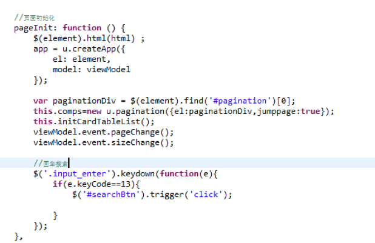

# 实战开发
## 币种节点
### 节点前知识点:
  - Router——前端路由框架
  - AMD——模块化管理工具
  - 数据模型——处理企业级复杂数据交互
  - UI——快速构建前端页面
  - UI模型——处理UI和数据模型之间的数据通信
### 单页应用 
`前端界面采用的单页面应用，单页Web应用（single page web application，SPA），就是只有一张Web页面的应用。单页应用程序 (SPA) 是加载单个HTML 页面并在用户与应用程序交互时动态更新该页面的Web应用程序。 浏览器一开始会加载必需的HTML、CSS和JavaScript，所有的操作都在这张页面上完成，都由JavaScript来控制。因此，对单页应用来说模块化的开发和设计显得相当重要。`

#### 单页面应用的优点是：
  - 速度：更好的用户体验，让用户在web app感受native app的速度和流畅，
  - MVC：经典MVC开发模式，前后端各负其责。
  - ajax：重前端，业务逻辑全部在本地操作，数据都需要通过AJAX同步、提交。
  - 路由：在URL中采用#号来作为当前视图的地址,改变#号后的参数，页面并不会重载
在平台中,实际只有index.html这一个单页面，在这个单页面中，加载了必须的CSS和JavaScript。然后有一个内容区，在点击菜单时，改变地址hash，我们用hash的变化从而推动界面相应的功能变化并在内容区中渲染出来。
那如何根据hash变化调用所需的js方法呢？来让前端路由吧！

#### 前端路由的实现

前端路由主要是用在单页面应用中，解决单页面应用里，地址变化，整体页面并不需要重新渲染，只重新渲染局内容。
平台中采用director.js开源框架做为默认的路由框架。基本用法如下：
- 1 var router = Router();
- 2 定义order路径所对应的操作

- 3 router.on('/order', function(){
- 4 具体的实现代码
- 5 });
- 6
- 7 router.init();

当浏览器地址变为：http://localhost#/ currtype时,会触发上面监听的function，找到对应的币种节点。
在平台前端主页面中，使用了router的相关方法来监听地址变化。同时使用requirejs来做动态加载。从而实现的整个单页面应用的运转。

#### AMD 规范化

AMD是"异步模块定义”。它采用异步方式加载模块，模块的加载不影响它后面语句的运行。所有依赖这个模块的语句，都定义在一个回调函数中，等到加载完成之后，这个回调函数才会运行。
AMD采用require()语句加载模块，但是不同于CommonJS，它要求两个参数：

` require([module], callback);`

- 第一个参数[module]，是一个数组，里面的成员就是要加载的模块；
- 第二个参数callback，则是加载成功之后的回调函数。例如:
` require(['math'], function (math) { math.add(2, 3);}); `

math.add()与math模块加载不是同步的，加载完math模块，运用math的add方法，这样浏览器不会发生假死现象。所以很显然，AMD比较适合浏览器环境。
目前，require.js是主要是实现了AMD规范的javascript库。平台中也是使用的require.js做为AMD模块化规范。可参见：http://www.requirejs.cn/ 学习requirejs的用法。

### 币种节点Currtype.html解析

### 币种节点 meta.js解析
#### 向导生成数据模型，字段默认类型为String

### 币种节点 Currtype.js解析
#### 使用requirejs的方式引用，前三个分别是：对应的html、数据模型js、对用的css。

#### 事件：打开节点时的页面初始化方法pageInit()，初始化界面及数据模型：

### 新增修改保存方法

